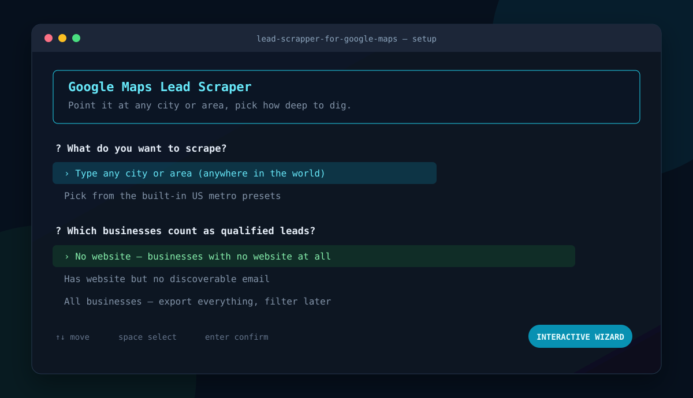
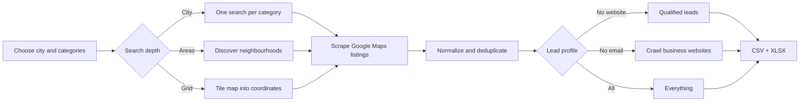
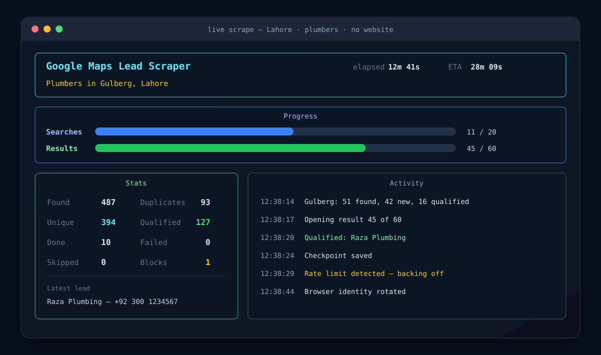
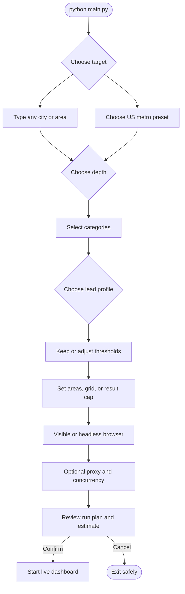
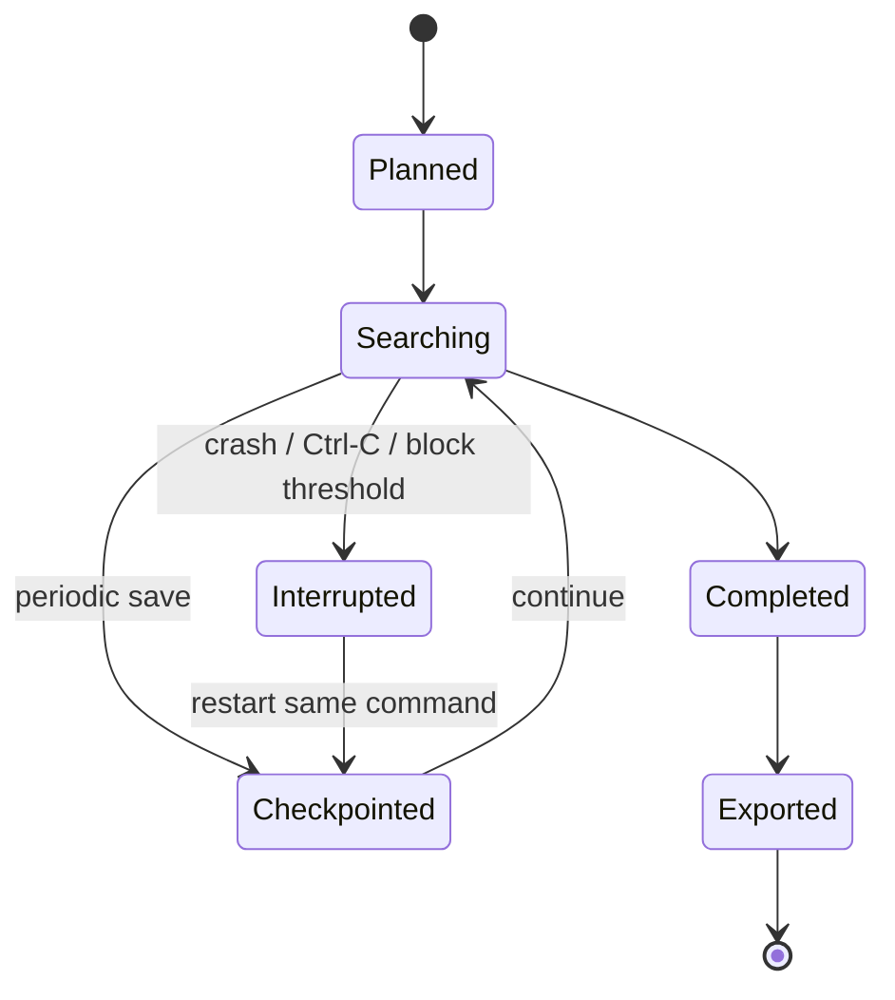
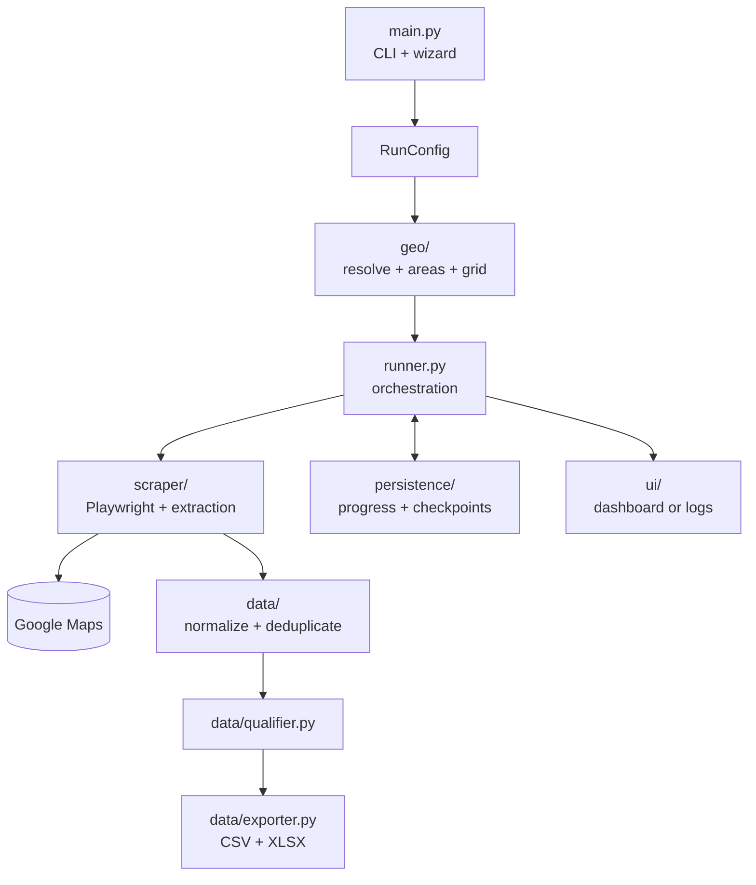

<div align="center">

# Google Maps Lead Scraper

### Find local businesses that need a website.

An async, resumable Playwright scraper that turns Google Maps results into
outreach-ready CSV and Excel lead lists — with a guided setup wizard and a live
terminal dashboard.

[](https://www.python.org/)
[](https://playwright.dev/python/)
[](#testing)
[](LICENSE)

**No API key · Any city worldwide · CSV + Excel · Crash-safe resume**

</div>



## What it does

Give the scraper a place and one or more business categories. It searches
Google Maps, opens each listing, extracts useful business data, removes
duplicates, and separates qualified leads from the full dataset.

The default lead profile is `no_website`: businesses whose Maps listing has no
website, subject to your phone, rating, and review thresholds.



### Why search depth matters

Google Maps exposes only a limited result set for one query. More focused
queries uncover businesses that a single city-wide search misses.

| Depth | Searches per category | Best for | Trade-off |
|---|---:|---|---|
| `city` | 1 | Quick test or small town | Fastest, shallowest coverage |
| `areas` | Up to 12 by default | Most real runs | Good coverage without manual coordinates |
| `grid` | Rows × columns | Dense metros and maximum coverage | Longest runtime, highest block risk |

`areas` is the recommended default. It probes Maps for localities and postal
areas, ranks them, then searches each area separately. `grid` divides a
coordinate span into cells; a `3x3` grid creates nine searches per category.

## See it run



The dashboard shows overall searches, current result progress, ETA, unique and
qualified lead counts, blocks, and recent activity. Docker and non-interactive
terminals automatically fall back to clean text logs.

## Quick start

### 1. Create an environment

Python 3.10–3.13 recommended. Playwright 1.49 does not support Python 3.14.

```bash
python3 -m venv .venv
source .venv/bin/activate
```

Windows PowerShell:

```powershell
py -3.12 -m venv .venv
.venv\Scripts\Activate.ps1
```

### 2. Install dependencies

```bash
python -m pip install -r requirements.txt
playwright install chromium
```

### 3. Launch the wizard

```bash
python main.py
```

The wizard asks for target, depth, categories (including any custom keyword), lead profile, thresholds,
browser mode, concurrency, and optional proxy. It shows estimated search count
and runtime before starting.

## Find businesses without websites

This is the main workflow and the default profile:

```bash
python main.py \
  --city "Lahore" \
  --depth areas \
  --categories plumbers electricians dentists \
  --profile no_website
```

For a safe first run:

```bash
python main.py \
  --city "Lahore" \
  --depth city \
  --categories plumbers \
  --profile no_website \
  --max-results 20
```

A `no_website` lead qualifies when:

- its Google Maps listing has no website;
- it has a phone number by default;
- known rating is at least `3.0` by default;
- known review count is at least `5` by default.

Missing ratings or review counts do not disqualify a business. Include leads
without phone numbers with `--no-require-phone`.

## Interactive journey



## Useful recipes

### Search discovered neighbourhoods

```bash
python main.py \
  --city "Austin TX" \
  --depth areas \
  --max-areas 8 \
  --categories roofing landscaping \
  --profile no_website
```

### Search a coordinate grid

```bash
python main.py \
  --city "Miami FL" \
  --depth grid \
  --grid 3x3 \
  --grid-span 20 \
  --categories dentists \
  --profile no_website
```

### Export every business

```bash
python main.py \
  --city "Camden, London" \
  --depth city \
  --categories bakery florist \
  --profile all
```

### Find sites without a discoverable email

```bash
python main.py \
  --city "Houston TX" \
  --depth areas \
  --categories accountants lawyers \
  --profile no_email
```

This profile visits business websites and checks the homepage plus common
contact/about pages for emails and social links, so it runs more slowly.

### Run without UI

```bash
python main.py \
  --city "Lahore" \
  --depth areas \
  --categories plumbers \
  --profile no_website \
  --headless --no-tui -y
```

## Output

Runs write to `output/` unless `--output DIR` is supplied.

| File | Purpose |
|---|---|
| `leads_raw.csv` | Every unique business found |
| `leads_qualified.csv` | Businesses matching selected lead profile |
| `leads.xlsx` | Raw and qualified leads as separate worksheets |
| `progress.json` | Completed search units for resume |
| `seen_keys.json` | Persistent deduplication pool |
| `checkpoints/` | Within-search recovery state |
| `scraper.log` | Full debug log |

Exported fields include name, category, address, phone, email, rating, reviews,
website state and URL, Facebook, Instagram, LinkedIn, claimed status, hours,
price level, coordinates, Plus Code, Place ID, Maps URL, target area, original
query, and scrape timestamp.

## Resume and recovery

Every run is resumable at two levels:

1. Completed searches are skipped when the same run starts again.
2. Active searches checkpoint scraped results, so a crash near result 100 does
   not restart that search from zero.

State uses atomic writes. Re-run the same command after a crash or `Ctrl-C`.
Use `--no-resume` only when a completely fresh scrape is intended.



## CLI reference

<details>
<summary><strong>Target and search planning</strong></summary>

| Option | Description |
|---|---|
| `--city TEXT`, `--area TEXT` | Any place Google Maps understands |
| `--metro NAME` | Built-in US metro preset |
| `--categories CAT ...` | One or more business categories |
| `--depth city\|areas\|grid` | Search coverage strategy |
| `--max-areas N` | Maximum discovered sub-areas |
| `--grid RxC` | Grid dimensions, such as `3x3` |
| `--grid-span KM` | Approximate grid width in kilometres |
| `--max-results N` | Maximum listings per search |

</details>

<details>
<summary><strong>Lead qualification</strong></summary>

| Option | Description |
|---|---|
| `--profile no_website\|no_email\|all` | Qualified lead definition |
| `--min-rating FLOAT` | Minimum known rating |
| `--min-reviews INT` | Minimum known review count |
| `--no-require-phone` | Permit leads without phone numbers |
| `--no-website-crawl` | Skip email and social discovery on websites |

</details>

<details>
<summary><strong>Runtime and tools</strong></summary>

| Option | Description |
|---|---|
| `--headless` | Hide browser window |
| `--proxy URL` | Use HTTP proxy |
| `--concurrency N` | Run multiple browsers; higher block risk |
| `--output DIR` | Change output directory |
| `--no-resume` | Ignore saved progress |
| `--no-tui` | Use plain logs instead of dashboard |
| `-y`, `--yes` | Skip wizard and confirmation |
| `--doctor` | Live-check Google Maps selectors and blocking |
| `--list-categories` | Print built-in categories |

</details>

Every setting also supports a `SCRAPER_` environment variable. Examples:

```bash
export SCRAPER_MIN_RATING=4.0
export SCRAPER_HEADLESS=true
export SCRAPER_OUTPUT_DIR=./my-leads
export SCRAPER_SEARCH_DELAY_MIN=8
```

See [`config/settings.py`](config/settings.py) for all tunables.

## Selector doctor

Google changes Maps markup. Check selectors before a long run:

```bash
python main.py --doctor
```

Doctor opens one live search and distinguishes selector drift from traffic
blocking — different problems requiring different fixes.

## Docker

```bash
docker compose up --build
```

Default Docker target comes from `docker-compose.yml`. Override it for one run:

```bash
docker compose run --rm scraper \
  python main.py --city "Austin TX" --depth areas \
  --categories plumbers --profile no_website --headless -y
```

Results appear in `./results` on the host. Docker uses plain logs because no
interactive terminal is attached.

## Staying below block thresholds

The scraper randomizes viewport, Chromium user agent, delays, idle pauses,
timezone, and browser contexts. It detects blocks during searches, retries with
exponential backoff, rotates browser identity, and stops after repeated blocks.

These measures reduce risk; they cannot guarantee uninterrupted scraping.

- Start with visible browser mode and concurrency `1`.
- Keep default randomized delays for first run.
- Use a reputable proxy for large workloads.
- Increase `SCRAPER_SEARCH_DELAY_MIN` after blocks.
- Prefer `areas` before escalating to a large grid.
- Avoid running multiple independent scrapes from same IP.

## Architecture



```text
main.py           CLI, wizard lifecycle, run summary
runner.py         Search orchestration, retries, resume
reporting.py      Statistics and reporter interface
config/           Settings, enums, presets, run config
geo/              Place resolution, areas, grid, plan
scraper/          Browser, Maps extraction, selectors
data/             Models, normalization, qualification, export
persistence/      Atomic progress and checkpoints
ui/               Interactive wizard and live dashboard
tests/            Offline unit and integration tests
```

## Testing

Tests are fully offline:

```bash
python -m pytest
```

Current suite covers CLI parsing, wizard lifecycle, selector contracts,
retries, extraction parsers, normalization, deduplication, lead profiles,
geography, persistence, export, and runner recovery.

## Responsible use

Use this project responsibly. Review Google Maps terms and applicable privacy,
marketing, and data-protection laws before collecting or contacting businesses.
Respect opt-outs and avoid abusive request rates or unsolicited bulk outreach.

## License

Released under the [MIT License](LICENSE).
